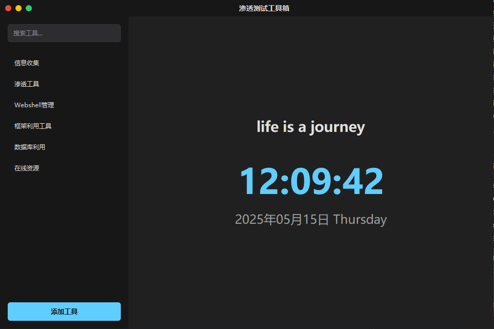

# 渗透测试工具箱



一个基于PyQt6开发的现代化渗透测试工具箱，用于高效管理和启动各类安全测试工具。

## ✨ 功能特点

- **美观的现代化界面**
  - 响应式布局适配不同分辨率
  - 左侧工具分类导航
  - 右侧工具按钮网格布局
  - 扁平化设计风格

- **全面的工具支持**
  - ✅ Java工具（支持多版本切换）
  - ✅ Python脚本工具
  - ✅ 独立GUI应用程序
  - ✅ 终端命令行工具
  - ✅ 在线URL资源

- **强大的管理功能**
  - 🔍 实时模糊搜索工具
  - ➕ 添加/编辑/删除工具
  - 🎨 按类型区分的颜色编码
  - 🖱️ 右键上下文菜单操作

## 🛠️ 项目结构

```
.
├── config.json            # 配置文件
├── main.py                # 程序入口
├── controllers/           # 业务逻辑
│   └── tool_controller.py # 工具控制器
├── models/                # 数据模型
│   └── config_model.py    # 配置模型
├── views/                 # 用户界面
│   ├── main_window.py     # 主窗口
│   ├── title_bar.py       # 自定义标题栏
│   ├── tool_button.py     # 工具按钮
│   └── ...                # 其他UI组件
└── utils/                 # 工具类
    ├── runner.py          # 工具运行器
    └── styles.py          # 样式管理
```

## ⚙️ 安装指南

### 系统要求
- Python 3.9+
- PyQt6

### 安装步骤
1. 克隆仓库：
```bash
git clone https://github.com/your-repo/penetration-toolbox.git
cd penetration-toolbox
```

2. 安装依赖：
```bash
pip install -r requirements.txt
```

3. 配置config.json：
```json
{
  "paths": {
    "java8": "/path/to/java8",
    "java11": "/path/to/java11",
    "java17": "/path/to/java17",
    "python3": "/path/to/python3",
    "open": "start"  # Windows系统使用"start"，Mac使用"open"
  },
  "categories": [
    {
      "name": "扫描工具",
      "tools": [
        {
          "name": "Nmap",
          "type": "terminal",
          "path": "/usr/bin/nmap",
          "command": ""
        }
      ]
    }
  ]
}
```

4. 运行应用：
```bash
python main.py
```

## 🚀 使用方法

### 基本操作
| 功能 | 操作 |
|------|------|
| 搜索工具 | 在顶部搜索框输入关键字 |
| 添加工具 | 点击"+"按钮填写信息 |
| 编辑工具 | 右键工具 → 编辑 |
| 删除工具 | 右键工具 → 删除 |
| 运行工具 | 单击工具按钮 |

### 工具类型说明
- **Java工具**：需要指定Java版本
- **Python工具**：使用系统Python解释器运行
- **GUI工具**：直接启动应用程序
- **终端工具**：在系统终端中运行
- **URL资源**：在默认浏览器中打开

## 🧑‍💻 开发者指南

### 代码风格
- 遵循PEP 8规范
- 使用类型注解
- 模块化设计

### 扩展功能
1. 添加新工具类型：
   - 在`utils/runner.py`中实现新的运行逻辑
   - 在`views/tool_button.py`中添加对应的样式

2. 修改UI样式：
   - 编辑`utils/styles.py`中的样式定义

### 测试建议
```bash
python -m unittest discover tests
```

## 🤝 贡献指南
欢迎提交Pull Request！请确保：
1. 代码符合PEP 8规范
2. 添加适当的类型注解
3. 更新相关文档
4. 通过基础测试

## 📜 许可证
MIT License
